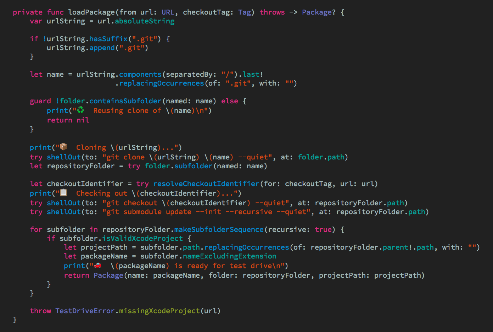

# 🎨 My Xcode theme - Sundell's Colors

This repository contains the Xcode theme that I use. Feel free to use it or modify it to your liking 👍



## Installing using Marathon

The easiest way to install this Xcode theme is using **[Marathon](https://github.com/johnsundell/marathon):**

1. Install the latest version of Marathon if you haven't already:
```
$ git clone https://github.com/johnsundell/marathon.git
$ cd Marathon && make
```

2. Run the install script which will install [Adobe's Source Code Pro](https://github.com/adobe-fonts/source-code-pro) font & this Xcode theme for you:
```
marathon run johnsundell/xcodetheme
```

## Installing manually

You can also choose to do things manually if you want:

1. Clone this repo:
```
$ git clone https://github.com/johnsundell/xcodetheme.git
```

2. Create a folder at this path if it doesn't exist already:
```
~/Library/Developer/Xcode/UserData/FontAndColorThemes
```

3. Copy the file `SundellsColors.xccolortheme` into the above folder.

4. Download the latest release of Source Code Pro from [its repo](https://github.com/adobe-fonts/source-code-pro).

5. Unzip the font archive and move the files in the `TTF` folder to `~/Library/Fonts`.

6. Should've used the install script, right? 😉

## Attributions

This Xcode theme is the result of years of tweaks and modifications to some version of a "Solarized" theme. I have no idea where I got the
original material for this theme from, but if you recognize some aspect of this theme as coming from something you made, feel free to open
an issue and I'll gladly add attributions to you 🙂
